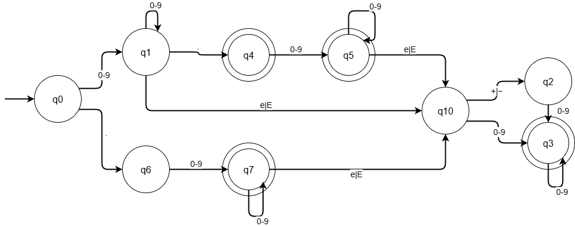
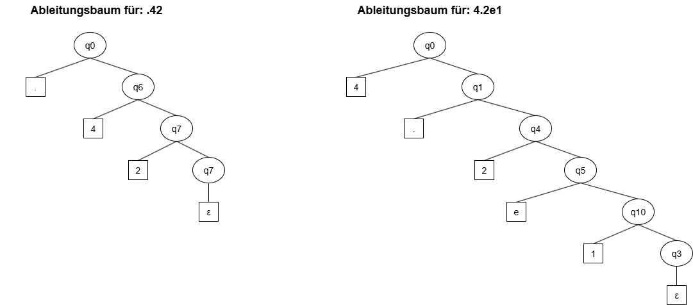

# A1.3 Java Gleitkommazahlen

## Valide Ausdrücke
42.    42.0    42e0    4.2e1    .42e2

## Regulärer Ausdruck

( (0-9)+ . (0-9)* ((e|E) (+|-)? (0-9)+)? | 
  (0-9)+ (e|E) (+|-)? (0-9)+ |
  . (0-9)+ ((e|E) (+|-)? (0-9)+)? )

**Erklärung der Java-Spezifika:**
- Mindestens eine Ziffer vor oder nach dem Punkt erforderlich (`.42` und `42.` sind gültig)
- Exponent `e` oder `E` mit optionalem Vorzeichen `+` oder `-`
- Nach dem Exponenten muss mindestens eine Ziffer folgen
- Optional: Suffix `f`, `F`, `d`, `D` (hier nicht berücksichtigt)

## DFA

Bezeichner: .42

| Zeichen | Zustand | 
|---------|---------|
|         |   q0    |
| .       |   q6    |
| 4       |   q7    |
| 2       |   q7    |

Bezeichner: 4.2e1

| Zeichen | Zustand | 
|---------|---------|
|         |   q0    |
| 4       |   q1    |
| .       |   q4    |
| 2       |   q5    |
| e       |   q2    |
| 1       |   q3    |

## reguläre Grammatik

G = {
    {q0,q1,q2,q3,q4,q5,q6,q7,q8,q9,q10}, 
    {0-9,.,e,E,+,-},
    P,
    q0
}

P = {
    q0 -> 0-9 q1 | . q6 
    q1 -> 0-9 q1 | e q10 | E q10 | . q4
    q2 -> 0-9 q3 
    q3 -> 0-9 q3 | ε
    q4 -> 0-9 q5 | ε
    q5 -> 0-9 q5 | e q10 | E q10 | ε
    q6 -> 0-9 q7
    q7 -> 0-9 q7 | e q10 | E q10 | ε
    q8 -> 0-9 q9
    q9 -> 0-9 q9 | ε
    q10 -> + q2 | - q2 | 0-9 q3
}

