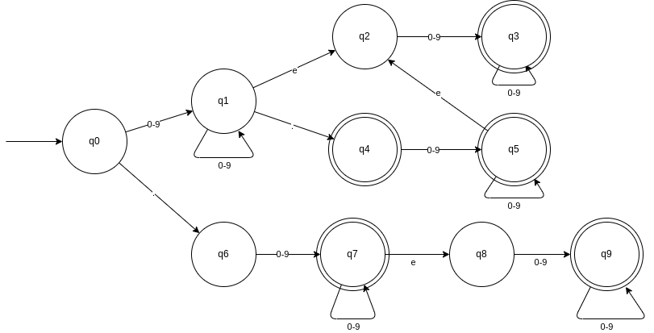

# A1.3 Python Gleitkommazahlen

## Valide Ausdrücke
42.    42.0    42e0    4.2e1    .42e2

## Regulärer Ausdruck

( (0-9)\* .  (0-9)(0-9)\*  ((e (0-9)(0-9\*))+ (0-9)\*) + 
(0-9)(0-9)\* e (0-9)(0-9)\*) +
( (0-9)(0-9)\* .)

42\. geht, da wir viele Ziffern zu Beginn schreiben dürfen und auch mit einem Punkt Enden können. 

42e1 geht auch, da wir mit einer Ziffer beginnen, belibig viele Ziffern danach schreiben dürfen, dann ein e haben und mit einer Ziffer nach dem e enden.

## DFA

Bezeichner: .42

| Zeichen | Zustand | 
|---------|---------|
|         |   q0    |
| .       |   q6    |
| 4       |   q7    |
| 2       |   q7    |

Bezeichner: 4.2e1

| Zeichen | Zustand | 
|---------|---------|
|         |   q0    |
| 4       |   q1    |
| .       |   q4    |
| 2       |   q5    |
| e       |   q2    |
| 1       |   q3    |

## reguläre Grammatik

G = {
    {q0,q1,q2,q3,q4,q5,q6,q7,q8,q9}, 
    {0-9,.,e},
    P,
    q0
}

P = {
    q0 -> 0-9 q1 | . q6 
    q1 -> 0-9 q1 | e q2 | . q4
    q2 -> 0-9 q3 
    q3 -> 0-9 q3 | ε
    q4 -> 0-9 q5 | ε
    q5 -> 0-9 q5 | e q2 | ε
    q6 -> 0-9 q7
    q7 -> 0-9 q7 | e q8 | ε
    q8 -> 0-9 q9
    q9 -> 0-9 q9 | ε
}

