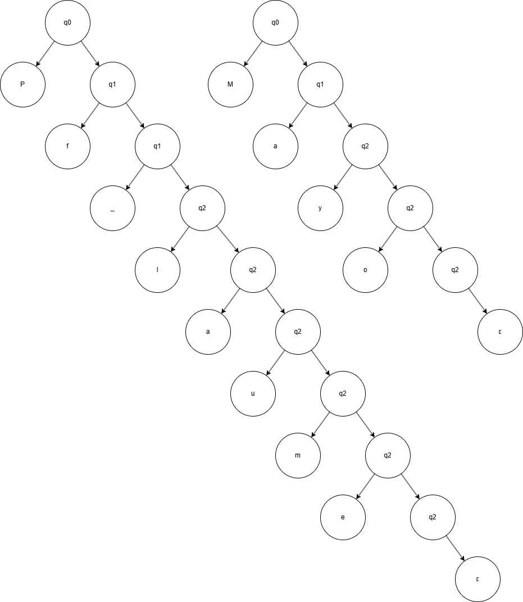
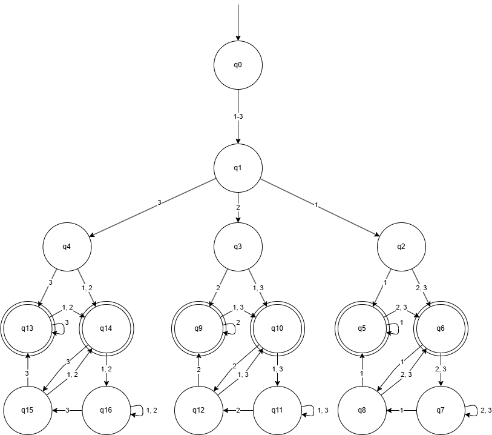

# Blatt 01: Reguläre Sprachen

## A1.1: Sprachen von regulären Ausdrücken

Die Sprache beinhaltet ein einzelnes 'a' und Wörter die mit 'a' beginnen und enden, mit beliebig vielen 'a' und 'b' dazwischen.

## A1.2: Bezeichner in Programmiersprachen

(a-zA-Z) (a-zA-Z0-9_)* (a-zA-Z0-9)

VCoole_variable123 ist ein gültiger Bezeichner, da er mit einem Buchstaben beginnt und nur Buchstaben, Ziffern und Unterstriche enthält. Das 123 am Ende ist erlaubt, da es nicht am Anfang steht.

p_Methode_123_hilfreich ist ebenfalls ein gültiger Bezeichner, da er mit einem Buchstaben beginnt und nur erlaubte Zeichen enthält.

Bezeichner: V_Test

| Buchstaben | Knoten |
|:----------:|--------|
|            | q0     |
| V          | q1     |
| _          | q1     |
| T          | q2     |
| e          | q2     |
| s          | q2     |
| t          | q2     |

Bezeichner: pFunc_T

| Buchstaben | Knoten |
|:----------:|--------|
|            | q0     |
| p          | q1     |
| F          | q2     |
| u          | q2     |
| n          | q2     |
| c          | q2     |
| _          | q1     |
| T          | q2     |

G = ({q0, q1, q2}, {a-zA-Z0-9, _}, P, q0)
P = {
    q0 -> a-zA-Z q1
    q1 -> a-zA-Z0-9 q2 | \_ q1
    q2 -> a-zA-Z0-9 q2 | \_ q1 | ε
}

## A1.3: Gleitkommazahlen in Programmiersprachen

## A1.4: Maildressen?

- Großzeichen gehen auch
- E-Mail-Adressen bestehen nicht nur aus Kleinbuchstaben.
- Erlaubt sind z. B. auch Zahlen, Punkte, Bindestriche, - Unterstriche und weitere Zeichen im lokalen Teil (links vom @).
- Es gibt Top-Level-Domains, die länger sind als ein Zeichen.

(a-zA-Z0-9)(a-zA-Z0-9._-)\* @ ((a-zA-Z0-9)(a-zA-Z0-9)\*) + ((a-zA-Z0-9)(a-zA-Z0-9-)\*(a-zA-Z0-9)) \. (a-zA-Z)(a-zA-Z)*

## A1.5: Der zweitletzte Buchstabe

## A1.6: Sprache einer regulären Grammatik

