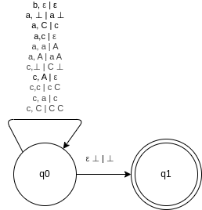
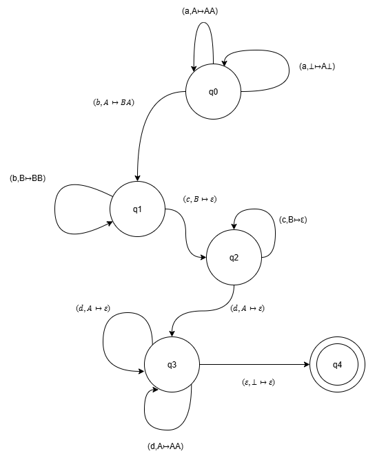

# CFG

## A2.1: PDA

L = { w ∈ { a , b , c } ∗ | w hat doppelt so viele a’s wie c’s }

P = ( Q ,   Σ ,   Γ ,   δ ,   q 0 ,   ⊥ ,   F )

P = ({q0, q1}, {a,b,c}, {a,A,c,C}, δ, q0, ⊥, {q1})

δ sieht man anhand des nachfolgenden Diagrams. Ich denke das braucht man nicht extra aufschreiben.

>[!WARNING]
> Wir können den Automaten nicht deterministisch machen, weil der aktuelle Automat den Zustand aacca nicht akzeptiert. Er würde das Akzeptieren, wenn wir a,A | Aa nehmen würden, allerdings würde dann aaaacc nicht akzeptiert werden. 
> Also sagen wir, dass der Automat sowohl a,A | Aa als auch a,A | aA akzeptiert und somit ist er nicht mehr deterministisch. 




### Beschreibung der Eingaben

#### bcaba

Startzustand: q0

| Zustand | Buchstabe | Übergang | Stack |
|---------|-----------|----------|-------|
|   q0    |           |          |   ⊥   |
|   q0    |    b      |  b,ε / ε |   ⊥   |
|   q0    |    c      |  c,⊥ / C |   C⊥  |
|   q0    |    a      |  a,C / c |   c⊥  |
|   q0    |    b      |  b,ε / ε |   c⊥  |
|   q0    |    a      |  a,c / ε |   ⊥   |
|   q1    |    ε      |  ε ⊥ / ⊥ |   ⊥   |

#### bccac

Startzustand: q0

| Zustand | Buchstabe | Übergang | Stack |
|---------|-----------|----------|-------|
|   q0    |           |          |   ⊥   |
|   q0    |    b      |  b,ε / ε |   ⊥   |
|   q0    |    c      |  c,⊥ / C |   C⊥  |
|   q0    |    c      |  c,⊥ / C |  CC⊥  |
|   q0    |    a      |  a,C / c |  cC⊥  |
|   q0    |    c      |  c,c / cC|  CcC⊥ |
|   XX    |    ε      |    XX    |  CcC⊥ |

## A2.2: Akzeptierte Sprache

Der gegebene PDA ist nicht deterministisch. Das kann man zum Beispiel beim Übergang von $\text q3$ sehen.
Hier gehen aus $\text q3$ zwei weitere Zustände hervor: $\text (q3, \epsilon)$ und $\text (q3, AA)$. Dadurch gibt es nicht nur einen Folgerzustand wodurch er nicht deterministisch ist.



Das 7-Tupel eines PDA setzt sich zusammen aus:

$
M = (Q, \Sigma, \Gamma, \delta, q_0, \bot, F)
$

mit:

$
\begin{aligned}
Q &= \{ q_0, q_1, q_2, q_3, q_4 \} \\
\Sigma &= \{ a, b, c, d \} \\
\Gamma &= \{ \bot, A, B \} \\
\delta &= \{
    (q_0, a, \bot) \mapsto (q_0, A\bot),\;
    (q_0, a, A) \mapsto (q_0, AA),\;
    (q_0, b, A) \mapsto (q_1, BA),\\
    &\quad (q_1, b, B) \mapsto (q_1, BB),\;
    (q_1, c, B) \mapsto (q_2, \varepsilon),\;
    (q_2, c, B) \mapsto (q_2, \varepsilon),\\
    &\quad (q_2, d, A) \mapsto (q_3, \varepsilon),\;
    (q_3, d, A) \mapsto (q_3, \varepsilon),\;
    (q_3, d, A) \mapsto (q_3, AA),\\
    &\quad (q_3, \varepsilon, \bot) \mapsto (q_4, \varepsilon)
\} \\
q_0 &= \text{Startzustand} \\
\bot &= \text{Startstapelsymbol} \\
F &= \{ q_4 \}
\end{aligned}
$

Der Automat

- pusht für jedes gelesene a ein Symbol A (also zählt er die Anzahl der a's),
- beim Wechsel zu b wird mindestens ein a erwartet (sonst fehlt ein A auf dem Stack), dann wird für jedes b ein B auf den Stack gelegt,
- für jedes c wird ein B wieder gepoppt (also müssen die Anzahl der c genau der Anzahl der b entsprechen),
- danach für jedes d wird ein A gepoppt (also müssen die Anzahl der d die Anzahl der a entsprechen),
- am Ende wird bei leerem Nutzstack (nur noch ⊥) per ε-Übergang in den akzeptierenden Zustand q4 gewechselt.

Damit ist die Sprache:

$\text L = {a^n b^m c^m d^n | n \geq 1, m \geq 1}$

Es sind mindestens ein a und ein b erforderlich, da dies von $\text q0$ und $\text q1$ für den Übergang verlangt wird.

## A2.3: Kontextfreie Sprache

Die Grammatik erzeugt die folgende Sprache:

- if `<Bedingung>` `<Anweisung>`
- if `<Bedingung>` `<Anweisung>` else `<Anweisung>`

Die Grammatik ist mehrdeutig, da es in der erzeugten Sprache ein Wort gibt, das auf mehr als eine Weise abgeleitet werden kann. Zum Beispiel kann der Ausdruck

```Python
if B1 if B2 A1 else A2
```

auf zwei verschiedene Arten interpretiert werden:

1. Die `else` gehört zum inneren `if`:

   ```Python
   if B1:
       if B2:
           A1
       else:
           A2
   ```

2. Die `else` gehört zum äußeren `if`:

    ```Python
    if B1:
            if B2:
                A1
    else:
            A2
    ```

## A2.4: Kontextfreie Grammatik

G = {
&nbsp;&nbsp;&nbsp;&nbsp;    {S, A, C, D, E}
&nbsp;&nbsp;&nbsp;&nbsp;    {a, b ,c}
&nbsp;&nbsp;&nbsp;&nbsp;    P,
&nbsp;&nbsp;&nbsp;&nbsp;    S
}

P = {
&nbsp;&nbsp;&nbsp;&nbsp;    S -> C | A
&nbsp;&nbsp;&nbsp;&nbsp;    A -> aA | E | ϵ
&nbsp;&nbsp;&nbsp;&nbsp;    C -> Cc | ϵ | D
&nbsp;&nbsp;&nbsp;&nbsp;    D -> aDb | C | ϵ
&nbsp;&nbsp;&nbsp;&nbsp;    E -> bEc | ϵ
}

Die Grammatik ist mehrdeutig, da das Wort "abc" auf zwei verschiedene Arten abgeleitet werden kann:

1. S -> A -> aA -> abEc -> abc
2. S -> D -> aDb -> abC -> abc


